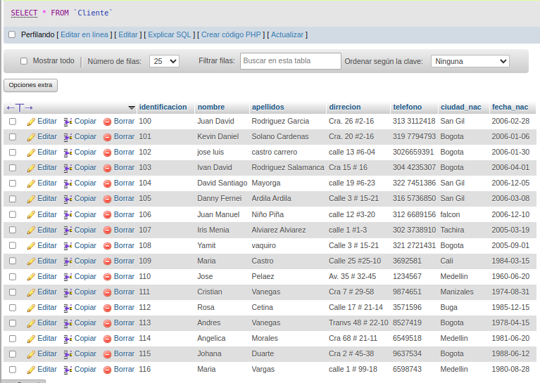
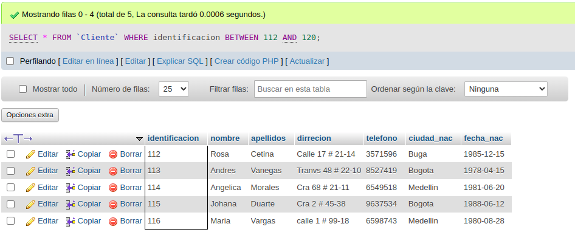

# Consultas_1_SQL
# INtroduccion a las consultas a una BD usando el lenguaje SQL 

## Base de datos: Ventas 
## Tabla: Cliente 

## Instruccion SELECT
1.- permite seleccionar datos de una tabla.
-su formato es: 'SELECT campos_tablas FROM nombre_tabla''

### Consulta No. 1
. Para visualizar toda la informacion que contiene la tabla Cliente se puede incluir con la instruccion SELECT el caracter **\*** o cada uno de los campos de la tabla.

- 'SELECT * FROM cliente'

- 'SELECT identificacion, nombre, apellidos, direccion, telefono, ciudad_nac, fecha_nac FROM Cliente'

## Consulta No. 2

2. Para visualizar solamente la identificacion del Cliente: 'SELECT identificacion FROM Cliente'

### Consulta No.3

3. si se desea obtener los registros cuya identificacion sea mayor o igual a 150, se debe utilizar la clausula 'WHERE' que especifica las condiciones que deben reunir los registros que se van a seleccionar: 'SELECT * FROM Cliente WHERE identificacion>=150

### Consulta No.4

4. Sedesea obtener los registros cuyos apellidos sean vanegas o cetina, se debe utilizar el operador IN que especifica los registros que se quieren visualizar de una tabla.

'SELECT apellidos FROM Cliente WHERE apellidos IN('Vanegas', 'Cetina')

O se puede utilizar el operador 'OR'

'SELECT apellidos FROM Clientes WHERE apellidos = 'Vanegas' OR apellidos = 'Cetina'

### Consulta No. 5

5. Se a menor que 110 y la ciudad sea cali, se debe utilizar el operador 'AND' 

'SELECT * FROM Clientes WHERE identificacion<=110 AND ciudad_nac = 'Cali'

### Consulta No. 6 

6. Si se desea obtener los registros cuyos nombres empiecen por la letra 'A', se debe utilizar el operador 'LIKE' que utiliza los patrones '%' (todos) y '_' (Caracter).

'SELECT * FROM Clientes WHERE nombre LIKE 'A%'

### Consulta No. 7

7. Se desea obtener los registros cuyos nombres contengan la letra 'a'

'SELECT * FROM cliente WHERE nombre LIKE '%a%'

### Consulta No. 8

8. Se desea obtener los registros donde la cuarta letra del nombre del cliente sea la letra 'a' 

'SELECT * FROM Cliente WHERE nombre LIKE '___a'

### Consultas No. 9 

9. Si se desea obtener los registros cuya identificacion este entre el intervalo 110 y 150, se debe utilizar la clausula 'BETWEEN' que sirve para especificar un intervalo de vaores.

'SELECT * FROM Clientes WHERE identificacion BETWEEN 110 AND 150

## Instruccion DELETE
-Permite borrar todos o un grupo especifico de registros de una tabla.
- Su formato es: 'DELETE FROM nombre_tabla'

### Eliminacion No. 1

1. Eliminar los registros cuya identificacion sea mayor a 170

'DELETE FROM cliente WHERE identificacion > 170

2. Eliminar los reistros cuya identificacion sea igual a 116

'DELETE FROM Clientes WHERE identificacion = 116'

## Instruccion UPDATE
-Permite actualizar un campo de una tabla.
- Su formato es: 'UPDATE nombre_tabla SET nombre campo = valor'

### Actualizacion No. 1

1. Para actualizar la ciudad de nacimiento de cristian vanegas, cuya identificacion es 114

'UPDATE Cliente set Ciudad_nac = 'Pereira' WHERE identificacion=111'

## Creacion tabla Cliente
### Diccionario de datos
|Campo|Tipo de dato|Longitud|
|-----|------------|--------|
|***no_pedido**||varchar|15|
|iden cliente||varchar|15|
|fecha compra|date||
|fecha vencimiento|date||
|observacion|varchar|35|

### Tabla: Pedidos

### Modelo Entidad - Relacion

## Operador INNER 30IN
- permite obtener datos de dos omas tablas.
-cuando se realiza la concatenacion de las tablas, no necesesariamente se deben mostrar todos los datos de las tablas.
-su formato es:
'SELECT tabla1.campo, tabla2.campo, ... FROM tabla_principal INNER 30IN tabla_secundaria ON campo_comun_tabla11 - campo_comun_tabla2

1. Para visualizar los campos identificacion, nombre, apellidos de a tabla cliente y no_pedido, fecha_compra, fecha_vencimiento y obsevacion de la tabla pedido,se debe realizar la siguiente instruccion.

SELECT Cliente.identificacion, Cliente.nombre, Cliente.apellidos, Pedido.no_pedido, Pedido.frcha_compra, Pedido.fecha_vencimiento, Pedido.observacion FROM Cliente INNER JOIN Pedido ON Cliente.identificacion = Pedido.iden_cliente;

2. Para visualzar todos los campos de las tablas cliente y pedido donde identificacion sea mayor que 100, se debe realizar la siguiente instruccion: 

SELECT Cliente .*,Pedido.* FROM Cliente INNER JOIN Pedido ON Cliente.identificacion = Pedido.iden_cliente WHERE Cliente.identificacion > 100;

